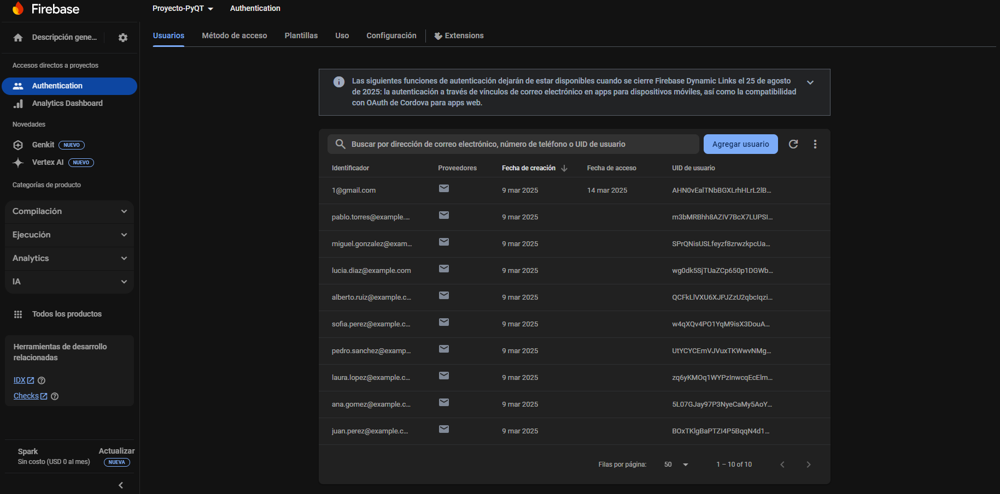
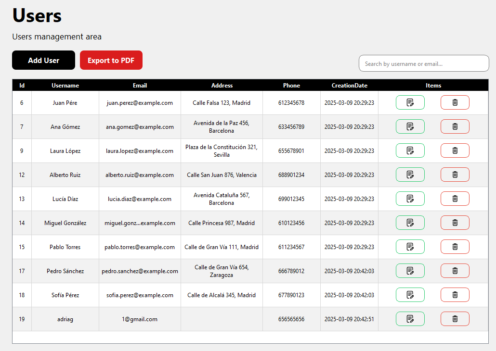

# App: Just Meat

## Logo corporativo

## Tipo de letra

- Titulos menú: Roboto
- Texto: Segoe UI

## Color corporativo

Hemos decidido usar el verde como color corporativo, ya que compagina bien con la temática de la empresa

## Explicación funcionamiento

Se ha creado una App con un login y registro de usuarios, haciendo uso de Fireabse auth.

Por otro lado, se ha creado varias tablas en SQLite con información relacionada, para las cuales hay una tabla con la que hacer las operaciones basicas (CRUD).

Por último, hay una página donde hacer una serie de consultas preestablecidas.

## Diagrama E-R

Archivo .SQL exportado de la base de datos: [**.SQL**](DataBase_Exported.sql)

## Usuarios en FireBase y Localmente

- El usuario usado para testear ha sido adriag. Para hacer login, usar: 1@gmail.com con contraseña: 123123aA. 

## Utilidades

 - En cuanto a la creación de la base de datos, se puede hacer facilmente ejecutando este archivo [**`archivo.sql`**](ruta/al/archivo.sql).
 - Como extra se ha añadido una exportación de datos de las tablas completas a PDF mediante el uso de la librería FPDF
 

## Empaquetar la App

Haciendo uso de PyInstaller, usando este comando he empaquetado todo

**pyinstaller --name "JustMeatApp" --add-data "database.db;." --add-data "ui/pages;ui/pages" --add-data "ui/dialogs;ui/dialogs" --add-data "ui/res;ui/res" --add-data "dialogs;dialogs" --add-data ".env;." --windowed main.py**
